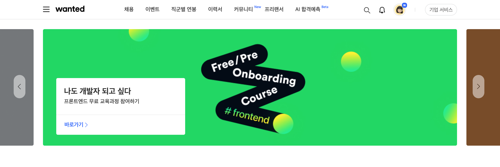

# <원티드 프리온보딩 코스>

  

  <a href="https://zealous-kepler-ffd67c.netlify.app/" target="_blank">
    <strong>https://zealous-kepler-ffd67c.netlify.app/</strong>
  </a>

 
 
 

### **상단 (GNB) 영역**

- 마크업 작업(HTML, CSS) | React 기반으로 클론
- 메뉴클릭, hover 등의 이벤트는 구현하지 않아도 됨

 
 

### **슬라이드 영역**

- 스와이프 이벤트, 왼쪽/오른쪽 버튼 클릭 이벤트 | 카드 이동
- 라이브러리 없이 직접 구현

 
 

### **반응형 구현**

- CSS media query 이용

 
 

### **Github Repository 주소와 배포 링크**

- Netlify로 배포
